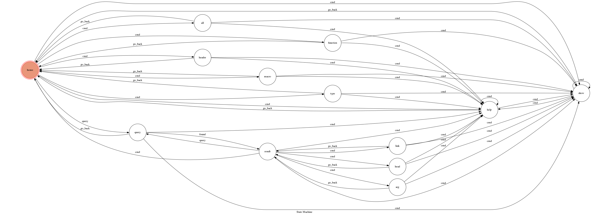

# TOC Project: C Librarian
[logo](./img/CLlogo.png)

A C library query bot

## Finite State Machine

## Usage
The initial state is set to `home`.

when on state `home`, you can use these commands :

/all: switch query mode to `all`

/function: switch query mode to `function`

/header: switch query mode to `header`

/macro: switch query mode to `macro`

/type: switch query mode to `type`

or you can just input some query, bot will try and find answers.

After you got some query result, you can use these commands to get more detail:

/head: show the header which the item belongs to

/arg N: show the description of Nth argument, where N is a non-negitive integer

/link: show the link of the web page which conains full description of this item

and these commands can be used anytime:

/help: show this help message

## Author
[wwolfyTC](https://github.com/wwolfyTC)
