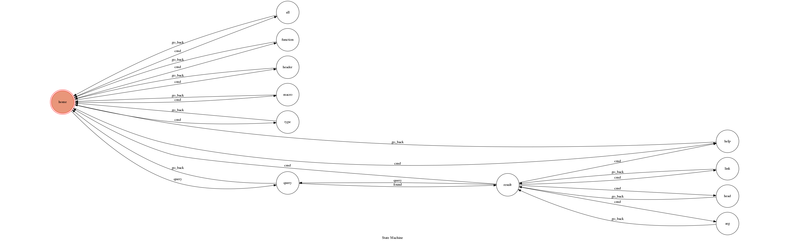

# TOC Project: C Librarian
[logo](./img/"CL logo.png")

A C library query bot

## Finite State Machine

## Usage
The initial state is set to `home`.
when on state `home`, you can use these commands :

*/all*: switch query mode to _all_
*/function*: switch query mode to _function_
*/header*: switch query mode to _header_
*/macro*: switch query mode to _macro_
*/type*: switch query mode to _type_

or you can just input some query, bot will try and find answers.

After you got some query result, you can use these commands to get more detail:
*/head*: show the header which the item belongs to
*/arg N*: show the description of Nth argument, where N is a non-negitive integer
*/link*: show the link of the web page which conains full description of this item

and these commands can be used anytime:
*/help*: show this help message
*/show*: show the FSM diagram of this bot

## Author
[wwolfyTC](https://github.com/wwolfyTC)
